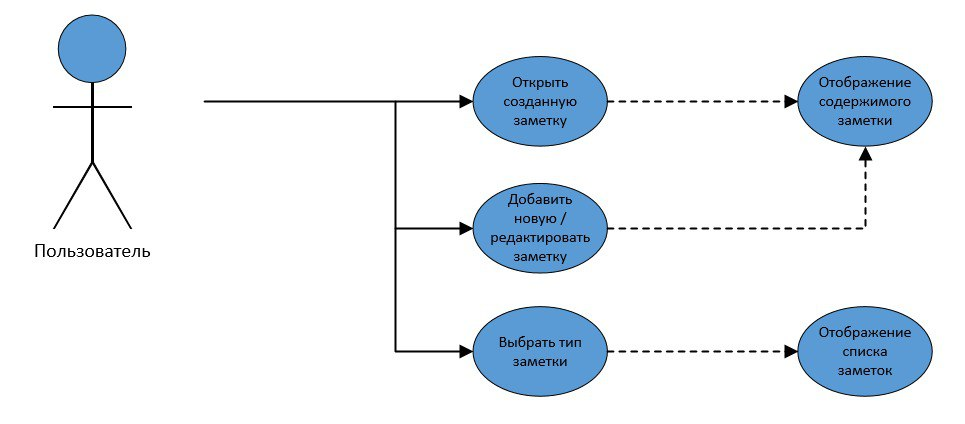
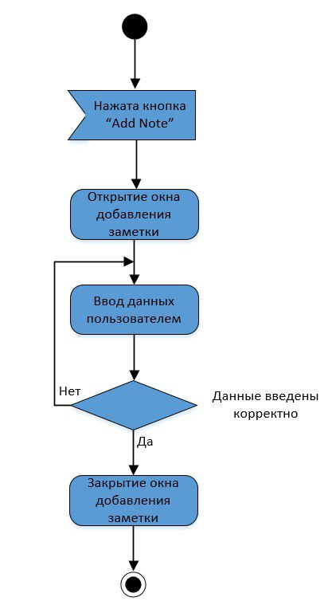
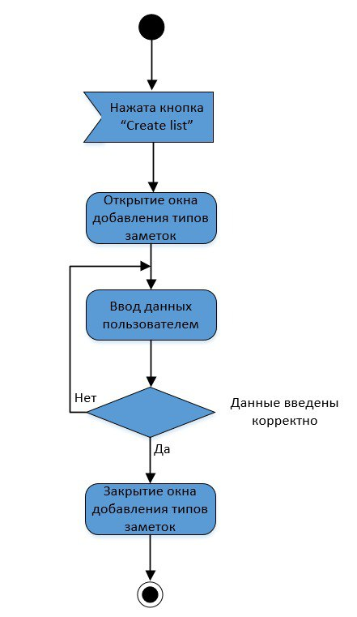
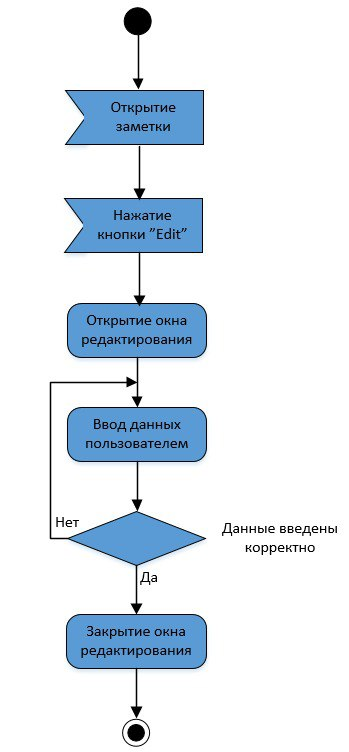
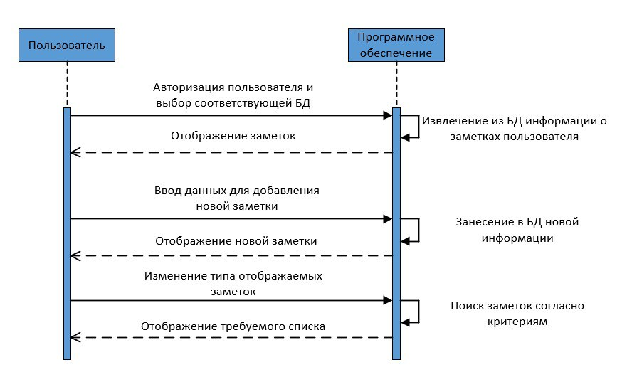
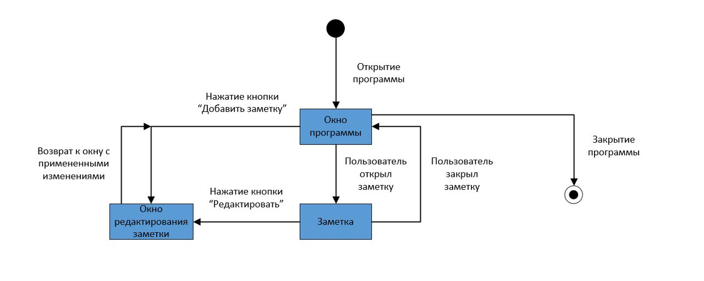
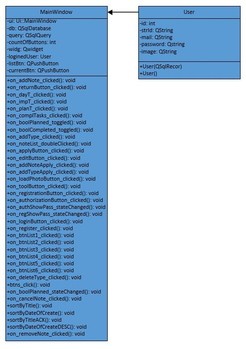
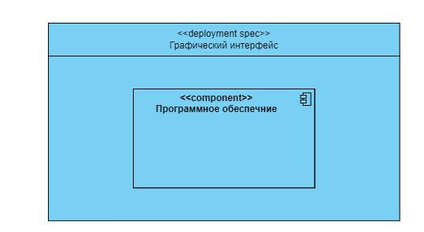

# Software Development Specification
# Содержание
1 [Диаграмма вариантов использования](#диаграмма-вариантов-использования)  
2 [Диаграммы активностей](#диаграммы-активностей)  
3 [Диаграммы последовательностей](#диаграммы-последовательностей)  
4 [Диаграммы состояний](#диаграммы-состояний)  
5 [Диаграмма классов](#диаграмма-классов)  
6 [Диаграмма компонентов и развертывания](#диаграмма-компонентов-и-развертывания)
7 [Описание хранения данных программы](#описание-хранения-данных-программы)

# Диаграмма вариантов использования

## 1 Актёры

| Актёр                     | Описание                                                                                         |
| :------------------------ | :----------------------------------------------------------------------------------------------- |
| Пользователь              | Человек, использующий приложение                                                                 |
| Клиент                    | Программное обеспечение                                                                          |

## 2 Варианты использования

Диаграмма программного обеспечения для создания заметок:

### 2.1 Описание вариантов использования 

**Описание.** 
Вариант использования "Создать заметку" позволяет пользователю создать новую заметку.

1. Пользователь выбирает опцию "Add Note".
2. ПО отображает окно создвния заметки.
3. Пользователь заполняет заголовок и описание заметки.
4. Пользователь выбирает критерии новой заметки.
5. ПО проверяет корректность данных.
6. Если данные введены некорректно, то кнопка "Apply" остается неактивной.
7. ПО сохраняет данные в базу данных.
8. ПО отображает новую заметку.
9. Конец варианта использования.

**Описание.** 
Вариант использования "Редактирование заметки" позволяет пользователю редактировать заметки.

1. Пользователь открывает заметку.
2. Пользователь нажимает кнопку "Edit".
3. ПО отображает окно редактирования.
4. Пользователь ищменяет записку.
5. ПО проверяет на корректность введённых данных. 
6. Если данные введены некорректно, то кнопка "Apply" остается неактивной.
7. ПО добавляет измененные данные в базу данных.
8. Конец варианта использования.

# Диаграммы активностей

1. Добавление новой заметки 

2. Изменение заметки

3. Добавление нового типа 

# Диаграммы последовательностей

# Диаграммы состояний

# Диаграмма классов

**Описание диаграммы классов.**

Класс MainWindow - содержит описание главного окна отображения списка товаров склада.  
Содержит следующие поля: 

•	 db – переменная соединения с базой данной  
•	 query – переменная представляющая интерфейс для выполнения операций SQL  
•	 countOfButtons – счетчик созданных групп   
•	 widg – указатель на виджет для корректного отображения формы с собственными группами   
•	 loginedUser – объект класса User, представляющий запись из таблицы 'users'   
•	 ui – объект описывающий окно и компоненты окна   
•	 listBtn – список созданных кнопок (кастомных групп)    
•  currentBtn – текущая выбранная группа  

Для работы используются следующие методы:  
•	on_addNote_clicked() - отображение формы с заполняемыми полями для создания заметки  
•	on_returnButton_clicked() - отмена редактирования заметки  
•	on_dayT_clicked() - отображение заметок группы "Daily tasks"   
•	on_impT_clicked() - отображение заметок группы "Important tasks"  
•	on_planT_clicked() - отображение заметок группы "Planned tasks"   
•	on_complTasks_clicked()  - отображение заметок группы "Completed tasks"   
•	on_boolPlanned_toggled() - отображение виджета дата/время   
•	on_addType_clicked() - отображение формы для ввода названия новой группы заметок    
•	on_noteList_doubleClicked(const QModelIndex &index) - отображение формы для редактирования заметки с выводом текущих значений   
•	on_applyButton_clicked() - сохранение информации о заметке после редактирования  
•	on_editButton_clicked() - отображение полной информации об заметке    
•	on_addTypeApply_clicked() - добавление новой группы заметок  
•	on_addNoteApply_clicked() - добавление новой заметки    
•	on_loadPhotoButton_clicked() - изменение изображения профиля    
•	on_toolButton_clicked() - отображение меню с функциями сортировки   
•	on_registrationButton_clicked() - отображение формы с регистрацией    
•	on_authorizationButton_clicked() - отображение формы с авторизацией   
•	on_authShowPass_stateChanged(int arg1) - показать/скрыть пароль при авторизации   
•	on_regShowPass_stateChanged(int arg1) - показать/скрыть пароль при регистрации    
•	on_loginButton_clicked() - авторизация пользователя   
•	on_registerButton_clicked() - регистрация нового пользователя   
•	on_btnList1_clicked() - отображение первой группы заметок   
•	on_btnList2_clicked() - отображение второй группы заметок   
•	on_btnList3_clicked() - отображение третей группы заметок   
•	on_btnList4_clicked() - отображение четвертой группы заметок    
•	on_btnList5_clicked() - отображение пятой группы заметок    
•	on_btnList16_clicked() - отображение шестой группы заметок    
•	on_deleteType_clicked() - удаление выбранной группы заметок       
•	btns_click() - выбор из базы данных заметок выбранной группы      
•	on_cancelNote_clicked() - отмена добавления новой заметки   
•	sortByTitle() - сортировка по заголовку по убыванию   
•	sortByDateOfCreate() - сортировка по дате создания по возрастанию   
•	sortByTitleACK() - сортировка по заголовку по возрастанию   
•	sortByDateOfCreateDESC() - сортировка по дате создания по убыванию    

Класс User - содержит следующие поля:  
•	id –  уникальный идентификатор пользователя   
•	strId – строчное представления id   
•	mail – логин пользователя     
•	password – пароль пользователя    
•	image – изображение профиля пользователя    

Для работы используются следующие методы:  
•	User – функция доступа к данным   
  
# Диаграмма компонентов и развертывания

# Описание хранения данных программы  

Описание параметров, хранящихся в базе данных:  

Таблица users:    
•	id - уникальный идентификатор пользователя    
•	mail - логин пользователя   
•	password - пароль   
•	image - изображения профиля пользователя    

Таблица groups:   
•	id - уникальный идентификатор группы заметок    
•	name - название группы    
•	user_id - id пользователя с которым группа связана   

Таблица notes_id:   
•	id - уникальный идентификатор заметки   
•	header - заголовок заметки    
•	info - основная информация о заметке    
•	date_time_of_create - дата создания заметки   
•	planned_date_time - запланированная дата выполнения заметки   
•	complited_date_time - время, когда заметка была выполнена   
•	is_important - является ли заметка важной   
•	is_completed - выполнена ли заметка   
•	group_id - id группы к которой относится заметка    
