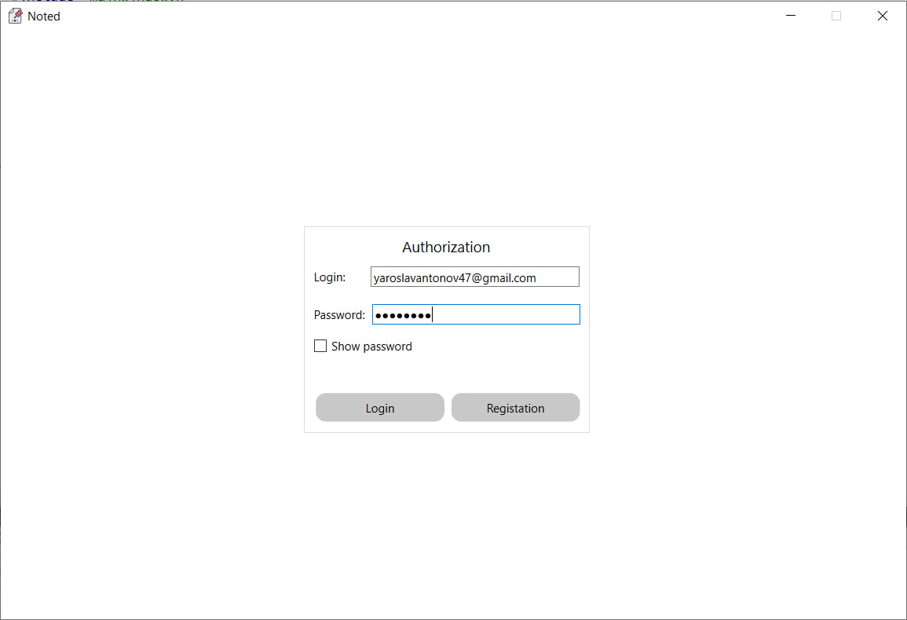
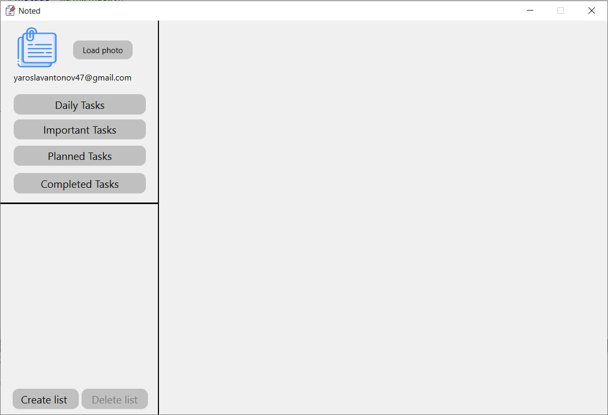
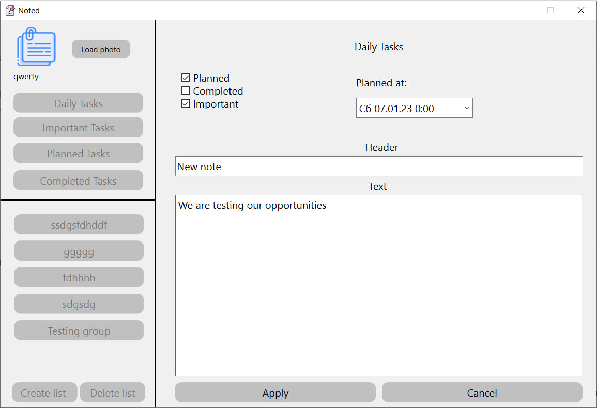
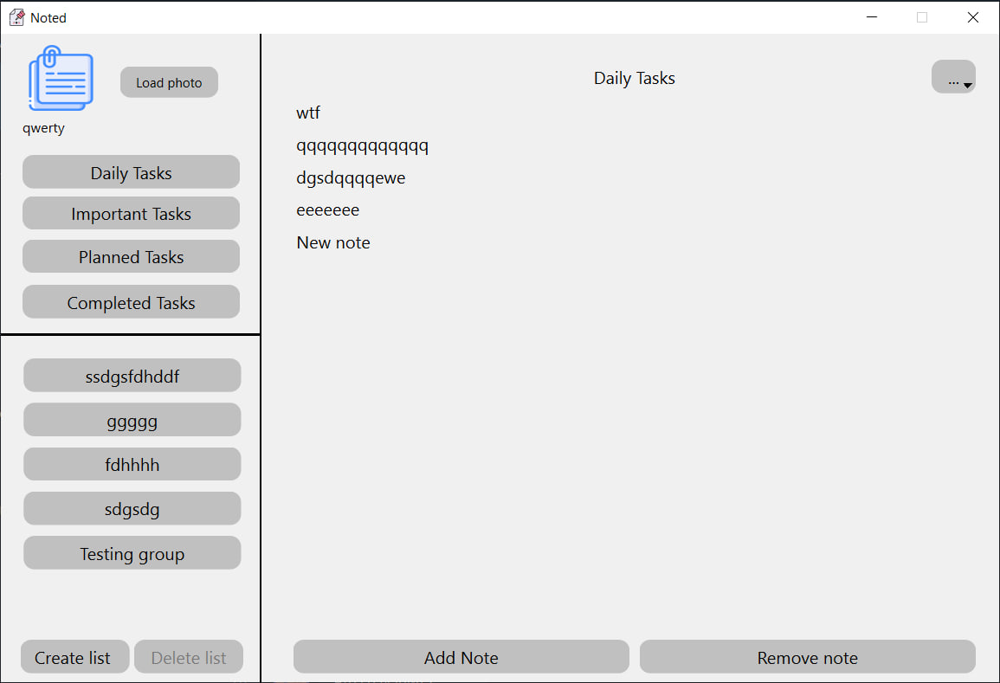
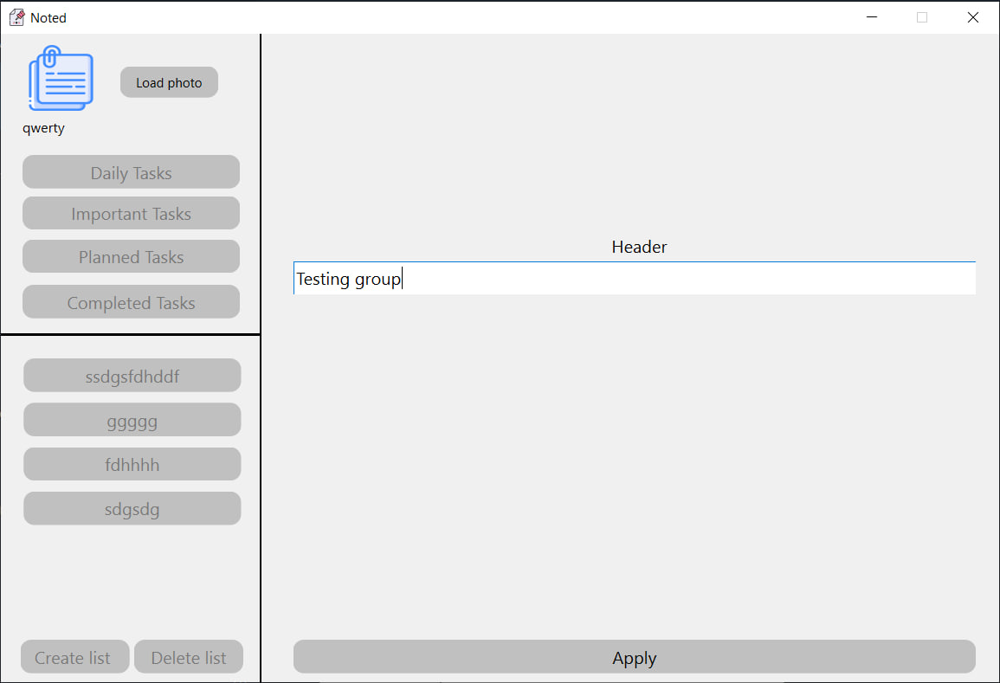
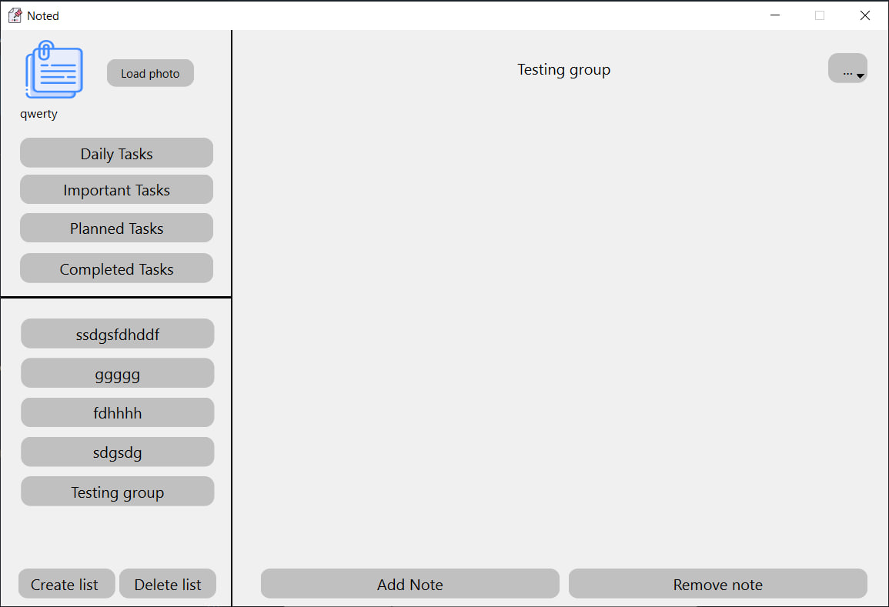
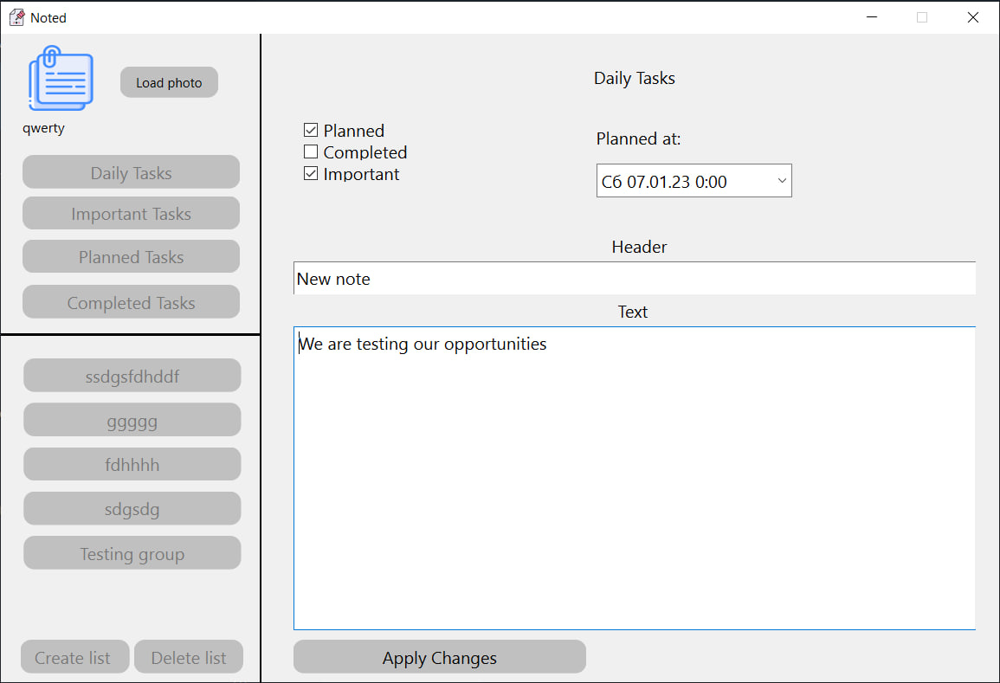
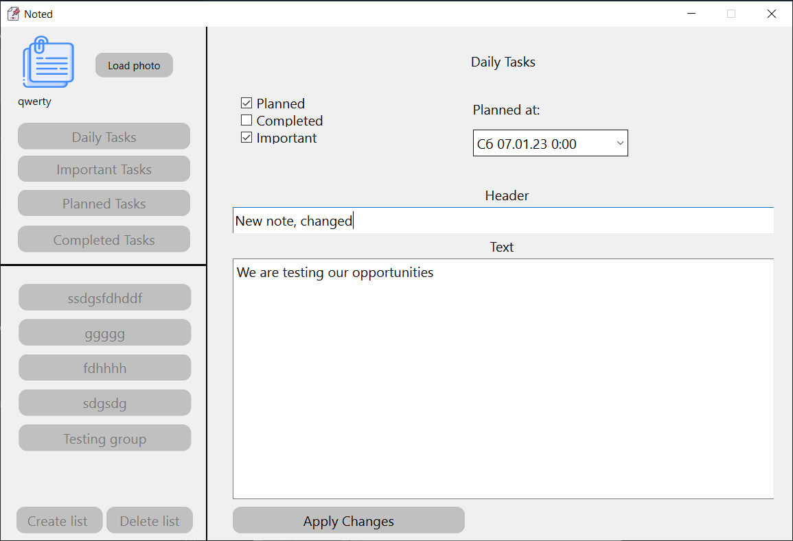
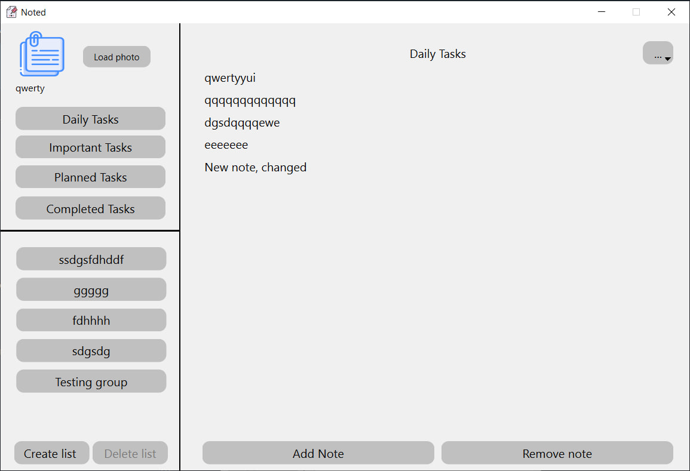

# Project testing

## Введение

Тестирование - это проверка соответствия реальных и ожидаемых результатов поведения программы, проводимая на конечном наборе тестов, выбранном определённым образом.В данном документе описывается процесс тестирования программы "Noted" для создания заметок. 

## 1  Описание тестирования

### 1.1  План тестирования

План тестирования описывает подход к тестированию, который использовался при проверке функционала проекта, и построен на основе реализаций решения задач проекта.

В документе представлены:
* Цель тестирования: описывают задачи которые должны выполнять тесты
* Требования к тестированию: правила, на которых будет основано тестирование, и описание процесса тестирования.
* Функциональное тестирование: тестирование исключительных ситуаций в ходе работы программного обеспечения.

## 2 Стратегия тестирования

### 2.1 Цель тестирования

Цель теста - убедиться в корректности выполнения функционала программного обеспечения и в корректности выводимых данных, а также в способности программного обеспечения выявить и обработать исключительные ситуации.
Конечным продуктом теста является выявление очевидных ошибок в программном обеспечении, которые должны быть выявлены до того, как их обнаружат пользователи программы.

### 2.2 Требования к тестированию

Функциональное тестирование должно проводиться для всех функций программного обеспечения. Должны быть отработаны алгоритмы выполнения функций и исключительные ситуации возникающие при их выполнении.
Все данные, передаваемые утилите должны быть проверены на корректность. Также необходимо провести тестирование реакции утилиты на некорректный ввод пользователя.
Среда тестирования должна полностью отображать реальное использование программного обеспечения по назначению. 

### 2.3 Функциональное тестирование

**Цель:** Проверить функциональность программного обеспечения. Функциональное тестирование выполняется путем ввода данных в программное обеспечение и проверкой вывода информации, обрабатываемой программным обеспечением. Также неообходимо проверить успешное выполнение операций.

**Метод:** Тесты производятся путем ввода данных в программное обеспечение и проверкой ожидаемого вывода, или же ожидаемой реакции программного обеспечения на исключительные ситуации.

**Критерии приемлемости теста:** Если вывод при тестировании совпадает с ожидаемым - тест пройден. Если сработала обработка исключительной ситуации - тест также считается пройден.

### 2.3.1 Тестирование функции авторизации/регистрации пользователей  

При запуске программы по умолчанию пользователь не авторизирован. Пользователь может как зарегестрировать новый аккаунт, так и зайти в существующий. При успешной авторизации пользователь получает доступ к своим заметкам.  

Окно авторизации  

Успешная авторизация  

### 2.3.2 Тестирование функции добавления заметки

При нажатии кнопки "Add Note" отобразится окно добавления заметки, в котором пользователь вводит параметры и содержимое создаваемой заметки. При правильном вводе данных будет доступна кнопка подтверждения создания заметки.  

Окно добавления заметки  

Отображение созданной заметки в списке  

### 2.3.3 Тестирование функции добавления пользовательского типа заметок

При нажатии кнопки "Create list" отобразится окно добавления нового типа заметок, в котором пользователь вводит название нового типа. При корректно введённых данных список отобразится в соответсвующей области.  

Окно добавления нового типа заметок  

Отображение нового типа заметок  

### 2.3.4 Тестирование функции редактирования заметок

При нажатии кнопки "Edit" после открытия заметки отобразится окно редактирования, в котором пользователь может изменить заголовок, содержание и тип заметки.  

Окно редактирования  

Измененный заголовок  

Результат изменения  

## 3 Среда тестирования

ОС: Windows 10  
Язык программирования: С++
